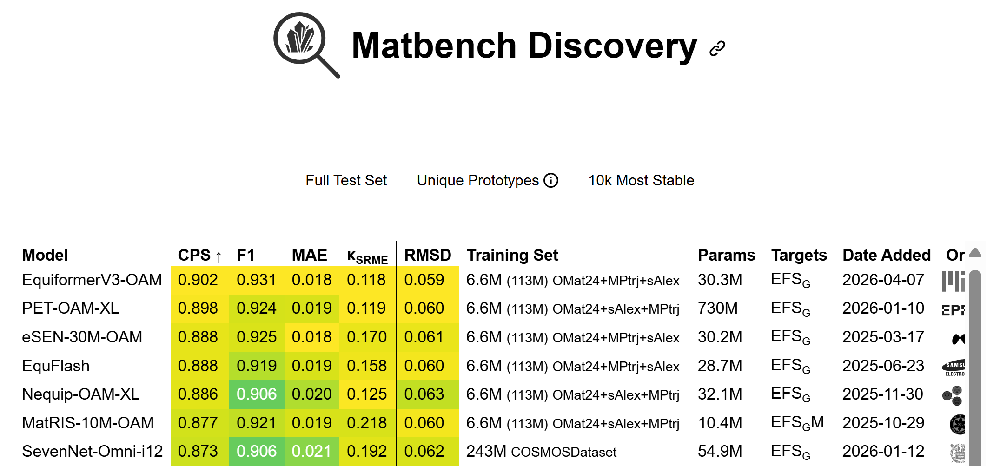

# EquiformerV3: Scaling Efficient, Expressive, and General SE(3)-Equivariant Graph Attention Transformers


**[Paper](https://arxiv.org/abs/2604.09130)** | **[Checkpoint](https://huggingface.co/mirror-physics/equiformer_v3)**


This repository contains the official PyTorch implementation of the work "EquiformerV3: Scaling Efficient, Expressive, and General SE(3)-Equivariant Graph Attention Transformers".
We provide the code for training on the OC20 S2EF-2M, MPtrj, OMat24, and sAlex datasets and for evaluation on Matbench Discovery.

Additional training configs for more datasets will be added in the future.

This repository is based on [this version of `fairchem`](https://github.com/facebookresearch/fairchem/tree/977a80328f2be44649b414a9907a1d6ef2f81e95).
We include the original codebase for ease of reproducibility and place the code relevant to our work under [`experimental`](experimental).


<p align="center">
	
</p>


<p align="center">
	
</p>


## Content ##
0. [Environment Setup](#environment-setup)
0. [File Structure](#file-structure)
0. [Training](#training)
0. [Checkpoint](#checkpoint)
0. [Evaluation](#evaluation)
0. [Acknowledgement](#acknowledgement)
0. [Citation](#citation)


## Environment Setup ##


### Environment 

See [here](experimental/docs/env_setup.md) for setting up the environment.


### OC20

1. The OC20 S2EF dataset can be downloaded by following instructions in their [GitHub repository](https://github.com/Open-Catalyst-Project/ocp/blob/5a7738f9aa80b1a9a7e0ca15e33938b4d2557edd/DATASET.md#download-and-preprocess-the-dataset).

2. For example, we can download the OC20 S2EF-2M dataset by running:

    ```bash
        # Incorrect Download, run the next cell
        cd ocp
        python scripts/download_data.py --task s2ef --split "2M" --num-workers 8
    ```

    ```bash
        # for downloading the 200k split
        cd src/fairchem/core
        python scripts/download_data.py --task s2ef --split "200k" --num-workers 8
        # also obtain the val_id subset
        python scripts/download_data.py --task s2ef --split "val_id" --num-workers 8
    ```


3. We note that we remove `--ref-energy` since we now train on total energy labels instead of adsorption energy labels.

<!-- 
4. We recommend evaluating the trained [checkpoints](#checkpoint) on the `val_id` subset to make sure the energy conversion is correct before running any training.
-->


### MPtrj

1. Download the dataset (`MPtrj_2022.9_full.json`) [here](https://figshare.com/articles/dataset/Materials_Project_Trjectory_MPtrj_Dataset/23713842?file=41619375).

2. Update [the path to the `.json` dataset](experimental/datasets/mptrj_convert_json_to_aselmdb.py#L17) and [the path to save the processed dataset](experimental/datasets/mptrj_convert_json_to_aselmdb.py#L18) in this [file](experimental/datasets/mptrj_convert_json_to_aselmdb.py).

3. Run the following command to convert `.json` dataset into `.aselmdb` dataset:
    ```bash
        python experimental/datasets/mptrj_convert_json_to_aselmdb.py
    ```

4. We remove structures in which any atom has no neighbor within 6Å.

5. We create `metadata.npz`, which records the number of edges for each structure for better load balancing:
    ```bash
        # Path to the directory containing .aselmdb files
        ASELMDB_DATASET=""

        python experimental/datasets/create_metadata_num_edges.py --input_dir $ASELMDB_DATASET
        
        # Rename to `metadata.npz`
        cd $ASELMDB_DATASET
        cp metadata_num-edges.npz metadata.npz
    ```


### OMat24 and sAlex

1. The datasets can be found [here](https://huggingface.co/datasets/facebook/OMAT24).

2. Same as MPtrj above, we create `metadata.npz`, which records the number of edges for each structure for better load balancing:
    ```bash
        # Path to the directory containing .aselmdb files
        ASELMDB_DATASET=""

        python experimental/datasets/create_metadata_num_edges.py --input_dir $ASELMDB_DATASET
        
        cd $ASELMDB_DATASET
        
        # Deprecate the original `metadata.npz`
        mv metadata.npz metadata_num-nodes.npz
        # Instead, use the one recording the number of edges
        cp metadata_num-edges.npz metadata.npz
    ```

3. For OMat24, we repeat 2. for all directories under `train` and `val`. That is, we need to do that for `aimd-from-PBE-1000-npt`, `aimd-from-PBE-1000-nvt`, `aimd-from-PBE-3000-npt`, `aimd-from-PBE-3000-nvt`, `rattled-1000`, `rattled-1000-subsampled`, `rattled-300`, `rattled-300-subsampled`, `rattled-500`, `rattled-500-subsampled`, `rattled-relax`.


## File Structure ##

We place all the files relevant to our work under [`experimental`](experimental).

1. [`configs`](experimental/configs) contains config files for training and evaluation.
2. [`datasets`](experimental/datasets) contains utility functions to preprocess datasets.
3. [`models`](experimental/models) contains EquiformerV3 (+ [DeNS](https://arxiv.org/abs/2403.09549)) models.
4. [`scripts`](experimental/scripts) contains the scripts for training and evaluation.
5. [`tasks`](experimental/tasks) contains the code of running simulations in Matbench Discovery, testing equivariance, and conducting body-order experiments. 
6. [`trainers`](experimental/trainers) contains the code for training and evaluation.


## Training ##

### OC20

1. OC20 S2EF-2M dataset (Index 7 in Table 1). 

    a. Modify [the path to the training set](experimental/configs/oc20/2M/equiformer_v3/experiments/base_N%408-L%406-C%40128-attn-hidden%4064-ffn%40512-envelope-num-rbf%40128_merge-layer-norm_gates2-gridmlp_use-gate-force-head_wd%401e-3-grad-clip%40100_lin-ref-e%404.yml#L7) and [the path to the validation set](experimental/configs/oc20/2M/equiformer_v3/experiments/base_N%408-L%406-C%40128-attn-hidden%4064-ffn%40512-envelope-num-rbf%40128_merge-layer-norm_gates2-gridmlp_use-gate-force-head_wd%401e-3-grad-clip%40100_lin-ref-e%404.yml#L23) in the [config file](experimental/configs/oc20/2M/equiformer_v3/experiments/base_N%408-L%406-C%40128-attn-hidden%4064-ffn%40512-envelope-num-rbf%40128_merge-layer-norm_gates2-gridmlp_use-gate-force-head_wd%401e-3-grad-clip%40100_lin-ref-e%404.yml).

    b. Update [the path to save results](experimental/scripts/train/oc20/s2ef/equiformer_v3/equiformer_v3_splits@2M_g@8.sh#L2) in the [training script](experimental/scripts/train/oc20/s2ef/equiformer_v3/equiformer_v3_splits@2M_g@8.sh).

    c. Run:
    ```bash
        sh experimental/scripts/train/oc20/s2ef/equiformer_v3/equiformer_v3_splits@2M_g@8.sh
    ```


### MPtrj

We provide the config and script for training EquiformerV3 with $L_{max} = 4$ here.
The preprocessing of MPtrj data is [here](#mptrj).


1. Direct pre-training

    a. Modify the [path to the training set](experimental/configs/omat24/mptrj/experiments/direct/equiformer_v3_N@7_L@4_attn-hidden@32_rbf@10_max-neighbors@300_attn-grid@14-8_ffn-grid@14_use-gate-force-head_merge-layer-norm_epochs@70-bs@512-wd@1e-3-beta2@0.95_dens-p@0.5-std@0.025-r@0.5-w@10-strict-max-r@0.75-no-stress.yml#L7) (the full MPtrj dataset) and the [path to the validation set](experimental/configs/omat24/mptrj/experiments/direct/equiformer_v3_N@7_L@4_attn-hidden@32_rbf@10_max-neighbors@300_attn-grid@14-8_ffn-grid@14_use-gate-force-head_merge-layer-norm_epochs@70-bs@512-wd@1e-3-beta2@0.95_dens-p@0.5-std@0.025-r@0.5-w@10-strict-max-r@0.75-no-stress.yml#L74) (we used a subset of sAlex validation set as the final evaluation is on Matbench Discovery) in the [config file](experimental/configs/omat24/mptrj/experiments/direct/equiformer_v3_N@7_L@4_attn-hidden@32_rbf@10_max-neighbors@300_attn-grid@14-8_ffn-grid@14_use-gate-force-head_merge-layer-norm_epochs@70-bs@512-wd@1e-3-beta2@0.95_dens-p@0.5-std@0.025-r@0.5-w@10-strict-max-r@0.75-no-stress.yml).

    b. Modify the [path to save results](experimental/scripts/train/omat24/equiformer_v3/equiformer_v3_mptrj.sh#L16) in the [training script](experimental/scripts/train/omat24/equiformer_v3/equiformer_v3_mptrj.sh). 

    c. The [training script](experimental/scripts/train/omat24/equiformer_v3/equiformer_v3_mptrj.sh) requires two nodes with 8 GPUs on each node. We note that the training script provides an example of launching distributed training on 2 nodes and that training can be launched in different manners.

    d. Run:
    ```bash
        bash experimental/scripts/train/omat24/equiformer_v3/equiformer_v3_mptrj.sh
    ```


2. Remove energy head from pre-trained checkpoint

    a. After direct pre-training, we remove the energy head from the checkpoints by running:
    ```bash
        # Path to the checkpoint of direct pre-training
        CHECKPOINT=""

        python experimental/tasks/remove_key_from_checkpoint.py --input-path $CHECKPOINT --remove-key energy_block
    ```

    b. This creates a new checkpoint (`.../checkpoint_no-energy_block.pt`), which is used to initialize model weights during gradient fine-tuning.


3. Gradient fine-tuning

    a. Modify the [path to the training set](experimental/configs/omat24/mptrj/experiments/gradient/equiformer_v3_grad-finetune_N@7_L@4_attn-hidden@32_rbf@10_max-neighbors@300_attn-grid@14-8_ffn-grid@14_pt-reg-dens-no-stress-strict-max-r@0.75-ft-no-reg_lr@0-5e-5-epochs@10-bs@64x8-wd@1e-3-beta2@0.95.yml#L7) (the full MPtrj dataset) and the [path to the validation set](experimental/configs/omat24/mptrj/experiments/gradient/equiformer_v3_grad-finetune_N@7_L@4_attn-hidden@32_rbf@10_max-neighbors@300_attn-grid@14-8_ffn-grid@14_pt-reg-dens-no-stress-strict-max-r@0.75-ft-no-reg_lr@0-5e-5-epochs@10-bs@64x8-wd@1e-3-beta2@0.95.yml#L75) (we used a subset of sAlex validation set as the final evaluation is on Matbench Discovery) in the [config file](experimental/configs/omat24/mptrj/experiments/gradient/equiformer_v3_grad-finetune_N@7_L@4_attn-hidden@32_rbf@10_max-neighbors@300_attn-grid@14-8_ffn-grid@14_pt-reg-dens-no-stress-strict-max-r@0.75-ft-no-reg_lr@0-5e-5-epochs@10-bs@64x8-wd@1e-3-beta2@0.95.yml).

    b. Modify the [path to pre-trained checkpoint](experimental/configs/omat24/mptrj/experiments/gradient/equiformer_v3_grad-finetune_N@7_L@4_attn-hidden@32_rbf@10_max-neighbors@300_attn-grid@14-8_ffn-grid@14_pt-reg-dens-no-stress-strict-max-r@0.75-ft-no-reg_lr@0-5e-5-epochs@10-bs@64x8-wd@1e-3-beta2@0.95.yml#L233). The path should be something like `.../checkpoint_no-energy_block.pt` obtained by running 2. above.

    c. Modify the [path to save results](experimental/scripts/train/omat24/equiformer_v3/equiformer_v3_grad_mptrj.sh#L16) in the [training script](experimental/scripts/train/omat24/equiformer_v3/equiformer_v3_grad_mptrj.sh). 

    d. The [training script](experimental/scripts/train/omat24/equiformer_v3/equiformer_v3_grad_mptrj.sh) requires two nodes with 8 GPUs on each node. We note that the training script provides an example of launching distributed training on 2 nodes and that training can be launched in different manners.

    e. Run:
    ```bash
        bash experimental/scripts/train/omat24/equiformer_v3/equiformer_v3_grad_mptrj.sh
    ```


### OMat24 → MPtrj and sAlex

We provide the config and script for training EquiformerV3 with $L_{max} = 4$ and $L_{max} = 6$ here.
The preprocessing of MPtrj data is [here](#mptrj).


1. Direct pre-training on OMat24

    a. Modify the [path to the training set](experimental/configs/omat24/omat24/experiments/direct/equiformer_v3_N@7_L@4_attn-hidden@32_rbf@64_max-neighbors@300_attn-grid@14-8_ffn-grid@14_use-gate-force-head_merge-layer-norm_epochs@4-bs@512-wd@1e-3-beta2@0.98-eps@1e-6_dens-p@0.5-std@0.025-r@0.5-0.75-w@1-no-stress-max-f@2.5_no-amp.yml#L5-L15) and the [path to the validation set](experimental/configs/omat24/omat24/experiments/direct/equiformer_v3_N@7_L@4_attn-hidden@32_rbf@64_max-neighbors@300_attn-grid@14-8_ffn-grid@14_use-gate-force-head_merge-layer-norm_epochs@4-bs@512-wd@1e-3-beta2@0.98-eps@1e-6_dens-p@0.5-std@0.025-r@0.5-0.75-w@1-no-stress-max-f@2.5_no-amp.yml#L81) in the [config file](experimental/configs/omat24/omat24/experiments/direct/equiformer_v3_N@7_L@4_attn-hidden@32_rbf@64_max-neighbors@300_attn-grid@14-8_ffn-grid@14_use-gate-force-head_merge-layer-norm_epochs@4-bs@512-wd@1e-3-beta2@0.98-eps@1e-6_dens-p@0.5-std@0.025-r@0.5-0.75-w@1-no-stress-max-f@2.5_no-amp.yml).

    b. Modify the [path to save results](experimental/scripts/train/omat24/equiformer_v3/equiformer_v3_omat24.sh#L16) in the [training script](experimental/scripts/train/omat24/equiformer_v3/equiformer_v3_omat24.sh). 

    c. The [training script](experimental/scripts/train/omat24/equiformer_v3/equiformer_v3_omat24.sh) requires four nodes with 8 GPUs on each node. We note that the training script provides an example of launching distributed training on four nodes and that training can be launched in different manners.

    d. Run:
    ```bash
        bash experimental/scripts/train/omat24/equiformer_v3/equiformer_v3_omat24.sh
    ```

    e. Repeat the above steps for $L_{max} = 6$.


2. Gradient fine-tuning on OMat24

    a. Modify the [path to the training set](experimental/configs/omat24/omat24/experiments/gradient/equiformer_v3_grad-finetune_N@7_L@4_attn-hidden@32_rbf@64_max-neighbors@300_attn-grid@14-8_ffn-grid@14_merge-layer-norm_lr@0-1e-4-epochs@2-bs@512-wd@1e-3-beta2@0.98-eps@1e-6_pt-reg-dens-ft-no-reg.yml#L5-L15) and the [path to the validation set](experimental/configs/omat24/omat24/experiments/gradient/equiformer_v3_grad-finetune_N@7_L@4_attn-hidden@32_rbf@64_max-neighbors@300_attn-grid@14-8_ffn-grid@14_merge-layer-norm_lr@0-1e-4-epochs@2-bs@512-wd@1e-3-beta2@0.98-eps@1e-6_pt-reg-dens-ft-no-reg.yml#L81) in the [config file](experimental/configs/omat24/omat24/experiments/gradient/equiformer_v3_grad-finetune_N@7_L@4_attn-hidden@32_rbf@64_max-neighbors@300_attn-grid@14-8_ffn-grid@14_merge-layer-norm_lr@0-1e-4-epochs@2-bs@512-wd@1e-3-beta2@0.98-eps@1e-6_pt-reg-dens-ft-no-reg.yml).

    b. Modify the [path to pre-trained checkpoint](experimental/configs/omat24/omat24/experiments/gradient/equiformer_v3_grad-finetune_N@7_L@4_attn-hidden@32_rbf@64_max-neighbors@300_attn-grid@14-8_ffn-grid@14_merge-layer-norm_lr@0-1e-4-epochs@2-bs@512-wd@1e-3-beta2@0.98-eps@1e-6_pt-reg-dens-ft-no-reg.yml#L241). The path should be something like `.../checkpoint.pt`.

    c. Modify the [path to save results](experimental/scripts/train/omat24/equiformer_v3/equiformer_v3_grad_omat24.sh#L16) in the [training script](experimental/scripts/train/omat24/equiformer_v3/equiformer_v3_grad_omat24.sh). 

    d. The [training script](experimental/scripts/train/omat24/equiformer_v3/equiformer_v3_grad_omat24.sh) requires four nodes with 8 GPUs on each node. We note that the training script provides an example of launching distributed training on four nodes and that training can be launched in different manners.

    e. Run:
    ```bash
        bash experimental/scripts/train/omat24/equiformer_v3/equiformer_v3_grad_omat24.sh
    ```

    f. Repeat the above steps for $L_{max} = 6$.


3. Gradient fine-tuning on MPtrj and sAlex

    a. Modify the [path to the training set](experimental/configs/omat24/salex_mptrj/experiments/gradient/equiformer_v3_grad-finetune_N@7_L@4_attn-hidden@32_rbf@64_max-neighbors@300_attn-grid@14-8_ffn-grid@14_attn-eps@1e-8_lr@0-5e-5-warmup@0.1-epochs@2-mptrj-salex-ratio@8-bs@256-wd@1e-3-beta2@0.98-eps@1e-6_pt-reg-dens-ft-no-reg-lr@1e-4.yml#L5-L13) and the [path to the validation set](experimental/configs/omat24/salex_mptrj/experiments/gradient/equiformer_v3_grad-finetune_N@7_L@4_attn-hidden@32_rbf@64_max-neighbors@300_attn-grid@14-8_ffn-grid@14_attn-eps@1e-8_lr@0-5e-5-warmup@0.1-epochs@2-mptrj-salex-ratio@8-bs@256-wd@1e-3-beta2@0.98-eps@1e-6_pt-reg-dens-ft-no-reg-lr@1e-4.yml#L81) in the [config file](experimental/configs/omat24/salex_mptrj/experiments/gradient/equiformer_v3_grad-finetune_N@7_L@4_attn-hidden@32_rbf@64_max-neighbors@300_attn-grid@14-8_ffn-grid@14_attn-eps@1e-8_lr@0-5e-5-warmup@0.1-epochs@2-mptrj-salex-ratio@8-bs@256-wd@1e-3-beta2@0.98-eps@1e-6_pt-reg-dens-ft-no-reg-lr@1e-4.yml).

    b. Modify the [path to pre-trained checkpoint](experimental/configs/omat24/salex_mptrj/experiments/gradient/equiformer_v3_grad-finetune_N@7_L@4_attn-hidden@32_rbf@64_max-neighbors@300_attn-grid@14-8_ffn-grid@14_attn-eps@1e-8_lr@0-5e-5-warmup@0.1-epochs@2-mptrj-salex-ratio@8-bs@256-wd@1e-3-beta2@0.98-eps@1e-6_pt-reg-dens-ft-no-reg-lr@1e-4.yml#L242). The path should be something like `.../checkpoint.pt`.

    c. Modify the [path to save results](experimental/scripts/train/omat24/equiformer_v3/equiformer_v3_grad_salex-mptrj.sh#L16) in the [training script](experimental/scripts/train/omat24/equiformer_v3/equiformer_v3_grad_salex-mptrj.sh). 

    d. The [training script](experimental/scripts/train/omat24/equiformer_v3/equiformer_v3_grad_salex-mptrj.sh) requires four nodes with 8 GPUs on each node. We note that the training script provides an example of launching distributed training on four nodes and that training can be launched in different manners.

    e. Run:
    ```bash
        bash experimental/scripts/train/omat24/equiformer_v3/equiformer_v3_grad_salex-mptrj.sh
    ```

    f. Repeat the above steps for $L_{max} = 6$.


## Checkpoint ##

Trained checkpoints can be found in the [HuggingFace page](https://huggingface.co/mirror-physics/equiformer_v3).

<!--
### OC20

|Split	|Epochs |Download	|val force MAE (meV / Å) |val energy MAE (meV) |
|---	|---	|---	|---	|---	|
| S2EF-2M (total energy) | 12 |[checkpoint]() \| [config](experimental/configs/oc20/2M/equiformer_v3/experiments/base_N%408-L%406-C%40128-attn-hidden%4064-ffn%40512-envelope-num-rbf%40128_merge-layer-norm_gates2-gridmlp_use-gate-force-head_wd%401e-3-grad-clip%40100_lin-ref-e%404.yml) | 18.15 | 201 |
-->

<!--
### MPtrj


### OMat24 → MPtrj and sAlex
-->


## Evaluation ##

### OC20

1. OC20 S2EF-2M dataset (Index 7 in Table 1)

    a. Follow the 1.a. [here](#oc20-1) to update the [config file](experimental/configs/oc20/2M/equiformer_v3/experiments/base_N%408-L%406-C%40128-attn-hidden%4064-ffn%40512-envelope-num-rbf%40128_merge-layer-norm_gates2-gridmlp_use-gate-force-head_wd%401e-3-grad-clip%40100_lin-ref-e%404.yml). 

    b. Download the OC20 checkpoint [here](#checkpoint).

    c. Modify [the path to save results](experimental/scripts/eval/oc20/s2ef/equiformer_v3/equiformer_v3_splits@2M_g@8.sh#L2), [the path to the validation set](experimental/scripts/eval/oc20/s2ef/equiformer_v3/equiformer_v3_splits@2M_g@8.sh#L7), and [the path to checkpoint](experimental/scripts/eval/oc20/s2ef/equiformer_v3/equiformer_v3_splits@2M_g@8.sh#L6) in the [evaluation script](experimental/scripts/eval/oc20/s2ef/equiformer_v3/equiformer_v3_splits@2M_g@8.sh).

    d. Run the script:
    ```bash
        sh experimental/scripts/eval/oc20/s2ef/equiformer_v3/equiformer_v3_splits@2M_g@8.sh
    ```


### OMat24

1. Evaluate on OMat24 validation set

    a. Follow [here](#omat24--mptrj-and-salex) to update the config files ([direct](experimental/configs/omat24/omat24/experiments/direct/equiformer_v3_N@7_L@4_attn-hidden@32_rbf@64_max-neighbors@300_attn-grid@14-8_ffn-grid@14_use-gate-force-head_merge-layer-norm_epochs@4-bs@512-wd@1e-3-beta2@0.98-eps@1e-6_dens-p@0.5-std@0.025-r@0.5-0.75-w@1-no-stress-max-f@2.5_no-amp.yml) and [gradient](experimental/configs/omat24/omat24/experiments/gradient/equiformer_v3_grad-finetune_N@7_L@4_attn-hidden@32_rbf@64_max-neighbors@300_attn-grid@14-8_ffn-grid@14_merge-layer-norm_lr@0-1e-4-epochs@2-bs@512-wd@1e-3-beta2@0.98-eps@1e-6_pt-reg-dens-ft-no-reg.yml)). 

    b. Download the OMat24 checkpoint [here](#checkpoint).

    c. Modify [the path to save results](experimental/scripts/eval/omat24/equiformer_v3/equiformer_v3_g@8.sh#L2), [the path to config file](experimental/scripts/eval/omat24/equiformer_v3/equiformer_v3_g@8.sh#L3), and [the path to checkpoint](experimental/scripts/eval/omat24/equiformer_v3/equiformer_v3_g@8.sh#L6) in the [evaluation script](experimental/scripts/eval/omat24/equiformer_v3/equiformer_v3_g@8.sh).

    d. Run the script:
    ```bash
        sh experimental/scripts/eval/omat24/s2ef/equiformer_v3/equiformer_v3_g@8.sh
    ```


### Matbench Discovery

1. Evaluate on discovery metrics

    a. Modify [the path to save preprocessed data](experimental/datasets/matbench_discovery_create_aselmdb.py#L8) and then run the command:
    ```bash
        cd experimental/datasets
        python matbench_discovery_create_aselmdb.py
    ```

    b. Modify [the path to checkpoint](experimental/scripts/eval/matbench_discovery/discovery.sh#L1), [the path to save results](experimental/scripts/eval/matbench_discovery/discovery.sh#L2), and [the path to the dataset](experimental/scripts/eval/matbench_discovery/discovery.sh#L3) in the [evaluation script](experimental/scripts/eval/matbench_discovery/discovery.sh).

    c. Run the calculation script:
    ```bash
        sh experimental/scripts/eval/matbench_discovery/discovery.sh
    ```

    d. Postprocess the calculation:
    ```bash
        # Path to save results in b. and c.
        INPUT_DIR=""

        python experimental/tasks/matbench_discovery/join_preds.py --input-dir $INPUT_DIR
    ```

    e. Evaluate the calculations and print results like F1 score and RMSD:
    ```bash
        # Path to save results in b. and c.
        INPUT_DIR=""

        python experimental/tasks/matbench_discovery/evaluate_discovery.py --input-dir $INPUT_DIR
    ```
    This would take about 30 minutes to get the RMSD results.


2. Evaluate on thermal conductivity task ($\kappa_{\text{SRME}}$)
    
    a. Modify [the path to save results](experimental/scripts/eval/matbench_discovery/kappa.sh#L2), and [the path to checkpoint](experimental/scripts/eval/matbench_discovery/kappa.sh#L1) in the [evaluation script](experimental/scripts/eval/matbench_discovery/kappa.sh).

    b. Run the script:
    ```bash
        sh experimental/scripts/eval/matbench_discovery/kappa.sh
    ```

    c. The results will be printed out after running the above command. If there is `2.0`, it is possibly because a certain structure hits out-of-memory error on GPUs. We can run the command on CPU for those structures.


## Acknowledgement ##

Our implementation is based on [PyTorch](https://pytorch.org/), [PyG](https://pytorch-geometric.readthedocs.io/en/latest/index.html), [e3nn](https://github.com/e3nn/e3nn), [timm](https://github.com/huggingface/pytorch-image-models), [fairchem](https://github.com/facebookresearch/fairchem/tree/977a80328f2be44649b414a9907a1d6ef2f81e95), [Equiformer](https://github.com/atomicarchitects/equiformer), [EquiformerV2](https://github.com/atomicarchitects/equiformer_v2), [DeNS](https://github.com/atomicarchitects/DeNS), [Matbench Discovery](https://github.com/janosh/matbench-discovery), and [Nequix](https://github.com/atomicarchitects/nequix).


## Citation ##

Please consider citing the works below if this repository is helpful:

- [EquiformerV3](https://arxiv.org/abs/2604.09130):
    ```bibtex
    @article{
        equiformer_v3,
        title={EquiformerV3: Scaling Efficient, Expressive, and General SE(3)-Equivariant Graph Attention Transformers}, 
        author={Yi-Lun Liao and Alexander J. Hoffman and Sabrina C. Shen and Alexandre Duval and Sam Walton Norwood and Tess Smidt},
        journal={arXiv preprint arXiv:2604.09130},
        year={2026}
    }
    ```

- [DeNS](https://arxiv.org/abs/2403.09549):
    ```bibtex
    @article{
        DeNS,
        title={Generalizing Denoising to Non-Equilibrium Structures Improves Equivariant Force Fields}, 
        author={Yi-Lun Liao and Tess Smidt and Muhammed Shuaibi* and Abhishek Das*},
        journal={arXiv preprint arXiv:2403.09549},
        year={2024}
    }
    ```

Please direct questions to Yi-Lun Liao (ylliao@mit.edu).